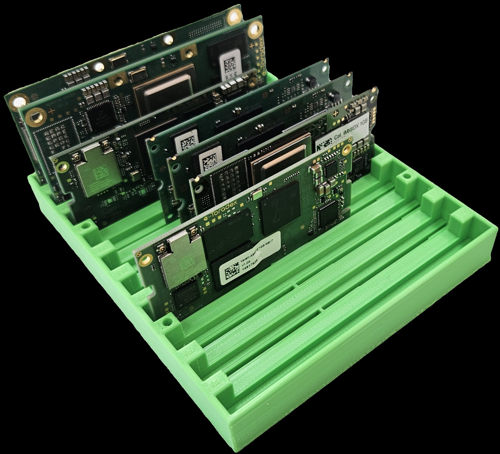

# Toradex SoM Holder #

This is the 3D model of an open case for holding Toradex SoMs on a workbench.

| | |
|-|-|
|||
|||

## Specs ##

* 10 SoM slots.
* Compatible with Apalis, Colibri, and Verdin.
* Stackable (alpha/testing).
